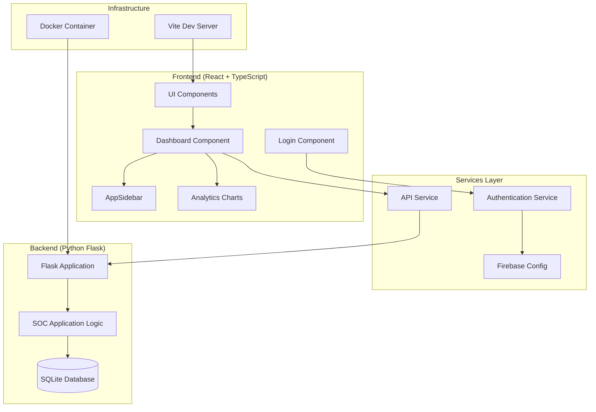
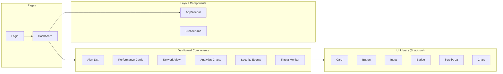
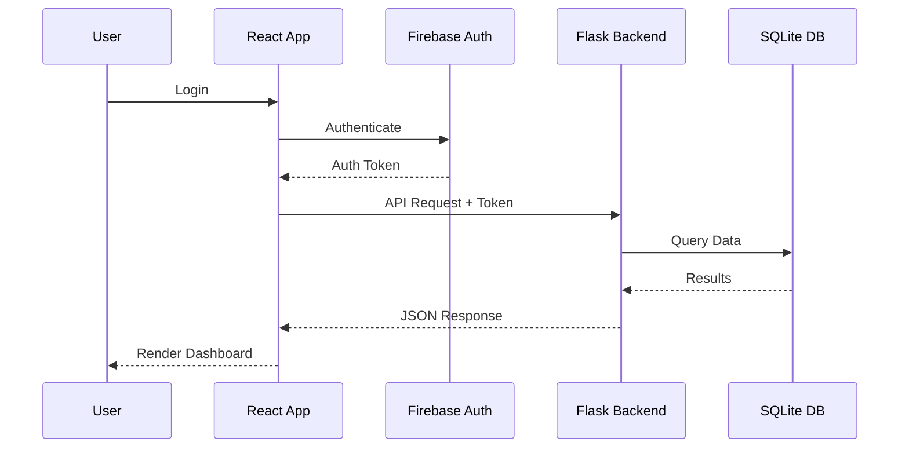

# Architecture Overview

This document provides a high-level architecture overview of the Integrate Security Operations Center (SOC) Dashboard.

## System Architecture



## Component Architecture



## Technology Stack

| Layer | Technology |
|-------|------------|
| Frontend | React 18, TypeScript, Vite |
| UI Components | Shadcn/ui, Radix UI, Lucide Icons |
| Styling | Tailwind CSS |
| Charts | Recharts |
| Backend | Python Flask |
| Database | SQLite |
| Auth | Firebase |
| Deployment | Docker, Docker Compose |

## Data Flow



## Directory Structure

```
├── src/
│   ├── App.tsx           # Main application component
│   ├── main.tsx          # Entry point
│   ├── components/
│   │   ├── Login.tsx     # Authentication component
│   │   ├── dashboard/    # Dashboard-specific components
│   │   ├── layout/       # Layout components (sidebar)
│   │   └── ui/           # Shadcn/ui components
│   ├── contexts/         # React contexts
│   ├── services/         # API and service layers
│   └── types/            # TypeScript type definitions
├── app.py                # Flask backend
├── soc_app.py            # SOC application logic
├── templates/            # HTML templates
├── Dockerfile            # Container configuration
└── docker-compose.yml    # Multi-container setup
```
