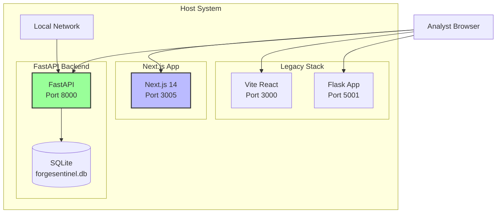

# ForgeSentinel Deployment Guide

## Architecture

ForgeSentinel runs as a dual-stack application:
- **Next.js Frontend** (port 3005) — Primary production UI
- **FastAPI Backend** (port 8000) — API, scanning engine, risk engine
- **Legacy Vite Dashboard** (port 3000) — Legacy standalone UI
- **Legacy Flask App** (port 5001) — Original SOC dashboard



## Quick Start

### Prerequisites
- Node.js 18+ and npm
- Python 3.11+
- Docker (optional)

### 1. Local Development

```bash
# Install frontend dependencies
npm install

# Create Python virtual environment
python3 -m venv api-venv
source api-venv/bin/activate
pip install -r apps/api/requirements.txt

# Run both frontend and backend
npm run dev
```

Access points:
- **Primary UI**: http://localhost:3005
- **API Docs**: http://localhost:8000/docs
- **Legacy Vite**: http://localhost:3000 (after `npm run vite:dev`)

### 2. Production Build

```bash
# Build Next.js frontend
npm run build

# Build Vite bundle with vendor chunk splitting
npm run vite:build

# Start backend
source api-venv/bin/activate
PYTHONPATH=. uvicorn apps.api.main:app --host 0.0.0.0 --port 8000
```

## Environment Variables

Create a `.env` file in the project root:

```bash
# Required for real scanning
REAL_SCAN_ENABLED=true
SCAN_ALLOWED_CIDRS=192.168.0.0/16,10.0.0.0/8,172.16.0.0/12
SCAN_MAX_HOSTS=1024
SCAN_HOST_WORKERS=50
SCAN_PORT_WORKERS=100
SCAN_CONNECT_TIMEOUT=1.0
SCAN_RATE_LIMIT_PER_SECOND=100

# Aether integration
AETHER_ENABLED=false
AETHER_API_BASE_URL=https://aether.example.com/api
AETHER_API_TOKEN=your-token

# Database
DATABASE_URL=sqlite:///./forgesentinel.db

# Next.js
NEXT_PUBLIC_API_URL=http://localhost:8000
```

## Docker Deployment

### Docker Compose (Recommended)

```yaml
version: '3.8'

services:
  api:
    build:
      context: .
      dockerfile: Dockerfile.api
    ports:
      - "8000:8000"
    environment:
      - DATABASE_URL=sqlite:///./data/forgesentinel.db
      - REAL_SCAN_ENABLED=true
      - SCAN_ALLOWED_CIDRS=192.168.0.0/16,10.0.0.0/8,172.16.0.0/12
    volumes:
      - ./data:/app/data
    network_mode: host
    cap_add:
      - NET_ADMIN
      - NET_RAW

  web:
    build:
      context: .
      dockerfile: Dockerfile.web
    ports:
      - "3005:3005"
    environment:
      - NEXT_PUBLIC_API_URL=http://localhost:8000
    depends_on:
      - api
```

### Build and Run

```bash
# Start all services
docker-compose up -d

# View logs
docker-compose logs -f

# Stop
docker-compose down
```

### Network Scanning in Docker

The API container uses `host` network mode to access your local network for scanning:
- Can discover devices on your local subnet
- Real MAC addresses via ARP
- Vendor identification from MAC OUI database
- Requires `NET_ADMIN` and `NET_RAW` capabilities

## Persistent Data

Data is persisted in two ways:

1. **SQLite Database**: `./data/forgesentinel.db`
   - All scan runs, assets, events, incidents
   - Audit records and replay traces
   - Aether links

2. **MAC OUI Database**: `./oui.txt` file
   - IEEE vendor database (~4MB)
   - Downloaded on first run
   - Cached for future use

## Updates and Maintenance

### Update Application

```bash
# Pull latest code
git pull

# Rebuild and restart
docker-compose down
docker-compose build --no-cache
docker-compose up -d
```

### View Logs

```bash
# All logs
docker-compose logs

# Follow logs (live)
docker-compose logs -f

# Last 100 lines
docker-compose logs --tail=100
```

### Backup Data

```bash
# Backup database
cp data/forgesentinel.db data/forgesentinel.db.backup-$(date +%Y%m%d)

# Or use Docker volume backup
docker run --rm \
  -v $(pwd)/data:/data \
  -v $(pwd)/backups:/backup \
  alpine tar czf /backup/forgesentinel-$(date +%Y%m%d).tar.gz /data
```

### Restore Data

```bash
# Restore from backup
cp data/forgesentinel.db.backup-20260108 data/forgesentinel.db

# Restart container
docker-compose restart
```

## Troubleshooting

### Container Won't Start

```bash
# Check logs for errors
docker-compose logs

# Check if ports are already in use
sudo lsof -i :8000
sudo lsof -i :3005

# Rebuild from scratch
docker-compose down -v
docker-compose build --no-cache
docker-compose up
```

### Network Scanning Not Working

1. **Verify host network mode** is enabled in docker-compose.yml
2. **Check container capabilities**:
   ```bash
   docker inspect forgesentinel-api | grep -A 5 CapAdd
   ```
3. **Test network access**:
   ```bash
   docker exec -it forgesentinel-api ping 8.8.8.8
   docker exec -it forgesentinel-api arp -a
   ```

### MAC Addresses Not Showing

1. **Check if arp command works**:
   ```bash
   docker exec -it forgesentinel-api arp -n
   ```
2. **Verify host network mode** (required for ARP)
3. **Run scan manually** to populate ARP cache:
   ```bash
   docker exec -it forgesentinel-api python -c "
   import subprocess
   subprocess.run(['ping', '-c', '1', '192.168.1.1'])
   subprocess.run(['arp', '-a'])
   "
   ```

### OUI Database Not Loading

```bash
# Download manually
docker exec -it forgesentinel-api curl -o /app/oui.txt https://standards-oui.ieee.org/oui/oui.txt

# Restart container
docker-compose restart
```

## Security Recommendations

### Production Deployment

1. **Change default secret key**:
   ```bash
   openssl rand -hex 32
   ```

2. **Use HTTPS/SSL**:
   - Set up reverse proxy (nginx/Caddy)
   - Get SSL certificate (Let's Encrypt)
   - Forward port 443 to container

3. **Restrict network access**:
   - Use firewall rules
   - Limit scan authorization scopes
   - Add VPN for remote access

4. **Regular backups**:
   - Automated daily backups
   - Store off-site
   - Test restore procedure

5. **Update dependencies**:
   ```bash
   # Update Python packages
   pip install --upgrade -r apps/api/requirements.txt

   # Update Node packages
   npm update
   ```

## Support

For issues or questions:
1. Check logs: `docker-compose logs -f`
2. Verify network connectivity
3. Check GitHub issues
4. Review API docs at `/docs`
