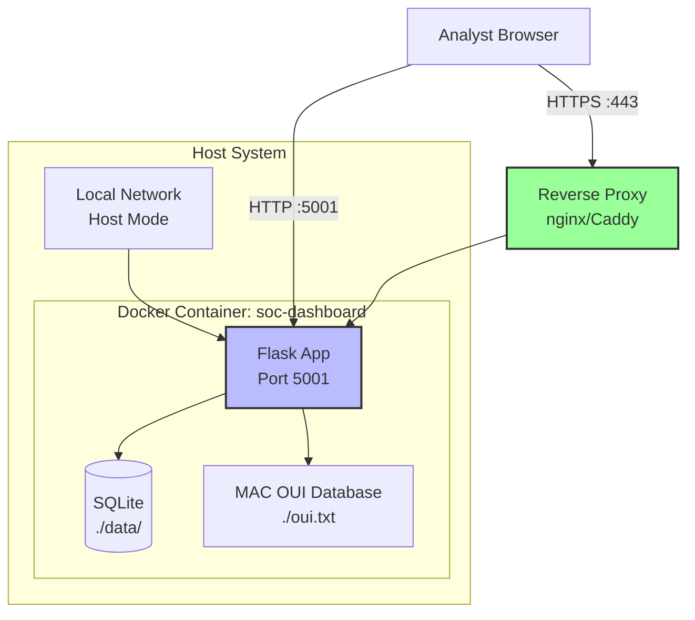

# SOC Dashboard - Docker Deployment Guide

## Quick Start

### Prerequisites
- Docker installed ([Get Docker](https://docs.docker.com/get-docker/))
- Docker Compose installed (included with Docker Desktop)
- Network access to scan (local network)

### 1. Build and Run with Docker Compose

```bash
# Navigate to project directory
cd /path/to/Security-Operations-Center-SOC-

# Start the container
docker-compose up -d

# View logs
docker-compose logs -f

# Stop the container
docker-compose down
```

### 2. Access the Dashboard

Open your browser to:
- **Dashboard**: http://localhost:5001
- **Login**: Use Firebase authentication

### 3. Network Scanning

The container uses `host` network mode to access your local network for scanning. This means:
- ✅ Can discover devices on your local subnet
- ✅ Real MAC addresses via ARP
- ✅ Vendor identification from MAC OUI database
- ⚠️  Container has more network privileges

---

## Deployment Architecture



## Detailed Setup

### Environment Variables

Create a `.env` file in the project root:

```bash
# Flask secret key (change in production!)
SECRET_KEY=your-super-secret-key-here-change-me

# Optional: Configure Firebase (if using custom config)
# FIREBASE_PROJECT_ID=your-project-id
```

### Build Options

#### Option 1: Docker Compose (Recommended)
```bash
docker-compose up -d
```

#### Option 2: Docker Build & Run Manually
```bash
# Build the image
docker build -t soc-dashboard:latest .

# Run the container with host network
docker run -d \
  --name soc-dashboard \
  --network host \
  --cap-add NET_ADMIN \
  --cap-add NET_RAW \
  -v $(pwd)/data:/app/data \
  -v $(pwd)/oui.txt:/app/oui.txt \
  -e SECRET_KEY=your-secret-key \
  soc-dashboard:latest

# View logs
docker logs -f soc-dashboard

# Stop container
docker stop soc-dashboard
docker rm soc-dashboard
```

### Persistent Data

Data is persisted in two ways:

1. **SQLite Database**: `./data/` directory
   - Contains all device inventory
   - Security events history
   - User sessions

2. **MAC OUI Database**: `./oui.txt` file
   - IEEE vendor database (~4MB)
   - Downloaded on first run
   - Cached for future use

### Network Configuration

#### Host Network Mode (Default)
```yaml
network_mode: "host"
```
**Pros**:
- Can scan local network directly
- Real MAC address discovery
- Accurate device identification

**Cons**:
- Less isolation
- Requires NET_ADMIN capability

#### Bridge Network Mode (Alternative)
```yaml
network_mode: "bridge"
ports:
  - "5001:5001"
```
**Pros**:
- Better isolation
- Standard Docker networking

**Cons**:
- Cannot scan local network
- Cannot discover MAC addresses
- Limited to simulated data

---

## Auto-Start on Boot

### Linux (systemd)

Create systemd service file:

```bash
sudo nano /etc/systemd/system/soc-dashboard.service
```

Add content:
```ini
[Unit]
Description=SOC Dashboard
Requires=docker.service
After=docker.service

[Service]
Type=oneshot
RemainAfterExit=yes
WorkingDirectory=/path/to/Security-Operations-Center-SOC-
ExecStart=/usr/bin/docker-compose up -d
ExecStop=/usr/bin/docker-compose down
TimeoutStartSec=0

[Install]
WantedBy=multi-user.target
```

Enable and start:
```bash
sudo systemctl daemon-reload
sudo systemctl enable soc-dashboard
sudo systemctl start soc-dashboard

# Check status
sudo systemctl status soc-dashboard

# View logs
sudo journalctl -u soc-dashboard -f
```

### macOS (launchd)

Create launch agent:

```bash
nano ~/Library/LaunchAgents/com.soc.dashboard.plist
```

Add content:
```xml
<?xml version="1.0" encoding="UTF-8"?>
<!DOCTYPE plist PUBLIC "-//Apple//DTD PLIST 1.0//EN" "http://www.apple.com/DTDs/PropertyList-1.0.dtd">
<plist version="1.0">
<dict>
    <key>Label</key>
    <string>com.soc.dashboard</string>
    <key>ProgramArguments</key>
    <array>
        <string>/usr/local/bin/docker-compose</string>
        <string>-f</string>
        <string>/path/to/Security-Operations-Center-SOC-/docker-compose.yml</string>
        <string>up</string>
        <string>-d</string>
    </array>
    <key>RunAtLoad</key>
    <true/>
    <key>WorkingDirectory</key>
    <string>/path/to/Security-Operations-Center-SOC-</string>
</dict>
</plist>
```

Load the agent:
```bash
launchctl load ~/Library/LaunchAgents/com.soc.dashboard.plist
launchctl start com.soc.dashboard
```

---

## Raspberry Pi Deployment

Perfect for 24/7 operation on your network!

### Requirements
- Raspberry Pi 3/4/5
- 2GB+ RAM recommended
- 16GB+ SD card
- Raspberry Pi OS (64-bit recommended)

### Installation Steps

1. **Install Docker**
```bash
curl -fsSL https://get.docker.com -o get-docker.sh
sudo sh get-docker.sh
sudo usermod -aG docker $USER
newgrp docker
```

2. **Install Docker Compose**
```bash
sudo apt-get update
sudo apt-get install -y docker-compose
```

3. **Clone/Copy Project**
```bash
git clone <your-repo-url> ~/soc-dashboard
cd ~/soc-dashboard
```

4. **Start Dashboard**
```bash
docker-compose up -d
```

5. **Set Auto-Start** (use systemd method above)

### Access Dashboard
- Local: http://raspberrypi.local:5001
- Remote: http://YOUR_PI_IP:5001

---

## Updates and Maintenance

### Update Application

```bash
# Pull latest code (if using git)
git pull

# Rebuild and restart container
docker-compose down
docker-compose build --no-cache
docker-compose up -d
```

### View Logs

```bash
# All logs
docker-compose logs

# Follow logs (live)
docker-compose logs -f

# Last 100 lines
docker-compose logs --tail=100
```

### Backup Data

```bash
# Backup database
cp data/soc_dashboard.db data/soc_dashboard.db.backup-$(date +%Y%m%d)

# Or use Docker volume backup
docker run --rm \
  -v $(pwd)/data:/data \
  -v $(pwd)/backups:/backup \
  alpine tar czf /backup/soc-data-$(date +%Y%m%d).tar.gz /data
```

### Restore Data

```bash
# Restore from backup
cp data/soc_dashboard.db.backup-20260108 data/soc_dashboard.db

# Restart container to use restored data
docker-compose restart
```

---

## Troubleshooting

### Container Won't Start

```bash
# Check logs for errors
docker-compose logs

# Check if ports are already in use
sudo lsof -i :5001

# Rebuild from scratch
docker-compose down -v
docker-compose build --no-cache
docker-compose up
```

### Network Scanning Not Working

1. **Verify host network mode** is enabled in docker-compose.yml
2. **Check container capabilities**:
   ```bash
   docker inspect soc-dashboard | grep -A 5 CapAdd
   ```
3. **Test network access**:
   ```bash
   docker exec -it soc-dashboard ping 8.8.8.8
   docker exec -it soc-dashboard arp -a
   ```

### MAC Addresses Not Showing

1. **Check if arp command works**:
   ```bash
   docker exec -it soc-dashboard arp -n
   ```
2. **Verify host network mode** (required for ARP)
3. **Run scan manually** to populate ARP cache:
   ```bash
   docker exec -it soc-dashboard python -c "
   import subprocess
   subprocess.run(['ping', '-c', '1', '192.168.1.1'])
   subprocess.run(['arp', '-a'])
   "
   ```

### OUI Database Not Loading

```bash
# Download manually
docker exec -it soc-dashboard curl -o /app/oui.txt https://standards-oui.ieee.org/oui/oui.txt

# Restart container
docker-compose restart
```

### Performance Issues

1. **Increase scan timeout** if network is slow
2. **Reduce scan range** in soc_app.py (currently scans 1-30)
3. **Add more resources**:
   ```yaml
   # In docker-compose.yml under soc-dashboard service
   deploy:
     resources:
       limits:
         cpus: '2'
         memory: 2G
   ```

---

## Security Recommendations

### Production Deployment

1. **Change default secret key**:
   ```bash
   # Generate random secret
   openssl rand -hex 32

   # Add to .env file
   echo "SECRET_KEY=$(openssl rand -hex 32)" > .env
   ```

2. **Use HTTPS/SSL**:
   - Set up reverse proxy (nginx/Caddy)
   - Get SSL certificate (Let's Encrypt)
   - Forward port 443 to container

3. **Restrict network access**:
   - Use firewall rules
   - Limit to local network only
   - Add VPN for remote access

4. **Regular backups**:
   - Automated daily backups
   - Store off-site
   - Test restore procedure

5. **Update dependencies**:
   ```bash
   # Update base image
   docker-compose pull
   docker-compose up -d

   # Update Python packages
   pip install --upgrade -r requirements.txt
   ```

---

## Support

For issues or questions:
1. Check logs: `docker-compose logs -f`
2. Verify network connectivity
3. Check GitHub issues
4. Review this documentation

---

## Performance Tips

- **Faster scans**: Reduce timeout in soc_app.py
- **More devices**: Increase scan range (currently 1-30)
- **Better detection**: Install nmblookup for NetBIOS names
- **Monitoring**: Add Prometheus/Grafana for metrics
