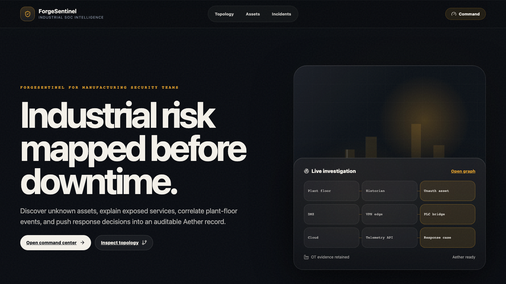
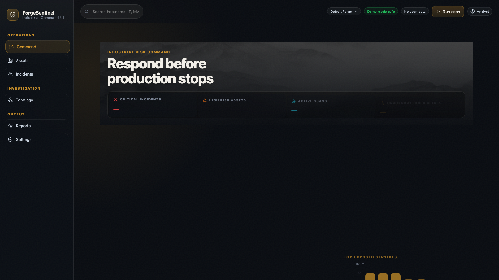
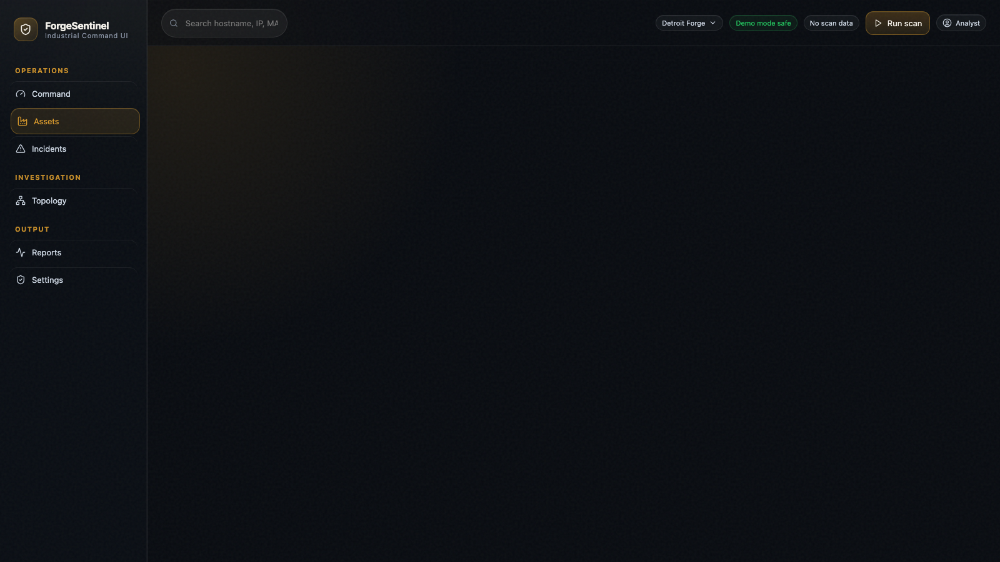
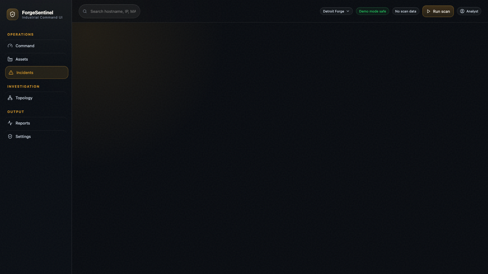
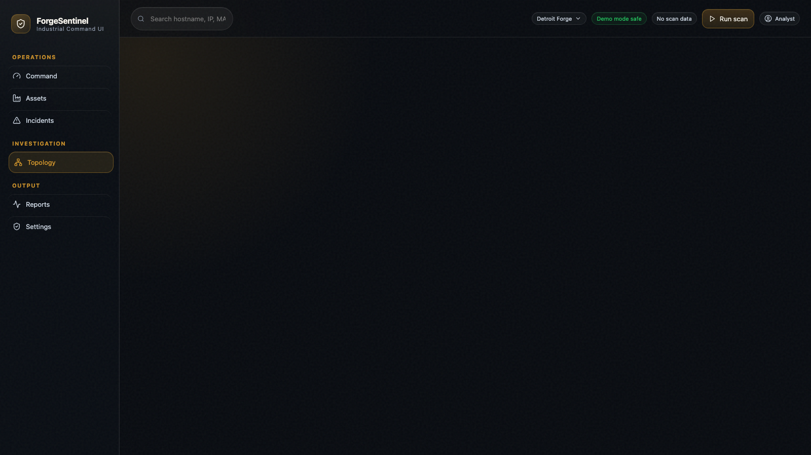

# ForgeSentinel

ForgeSentinel is a manufacturing-focused SOC and Asset Risk Intelligence Platform. It discovers authorized network assets, records scan observations, normalizes assets, computes explainable risk decisions, correlates incidents, generates recommendations, stores audit replay events, and optionally creates Aether OpsCenter tickets for operational response.

This is not just a dashboard — it is an operational security decision system.

## Screenshots

### Landing Page


### Command Center


### Asset Intelligence


### Incident Workbench


### Topology Investigation


## Architecture

The UI is fully API-backed. All production pages fetch data from the FastAPI backend. Static fixture data exists only in `lib/fixtures/` and is used for seeding/demo scenarios.

```
Authorized scan/import
        ↓
scan_observations table
        ↓
asset_service.upsert_asset()
        ↓
security_events table
        ↓
risk_engine.compute()
        ↓
risk_decisions table
        ↓
correlation_engine.correlate()
        ↓
incidents table
        ↓
recommendation_engine.generate()
        ↓
recommendations table
        ↓
audit_records table
        ↓
Next.js UI via API
```

## Core Workflows

- **Command Center**: `/command` is the real-time SOC workspace with command summary, KPI grid, prioritized risk queue, active incident panel, live event stream, exposure charts, topology preview, and scan status.
- **Asset Intelligence**: `/assets` provides object-centric asset workflows with API-backed inventory, risk decisions, triggered rules, ports, evidence, and audit trails.
- **Incident Workbench**: `/incidents/[incidentId]` shows correlated security incidents with evidence timelines, decision traces, analyst notes, ranked recommendations, and Aether ticket creation.
- **Topology**: `/topology` visualizes assets by segment using React Flow with risk rings, incident correlations, and clickable asset details.
- **Audit Replay**: `/replay/[entityId]` provides asset and incident audit replay with expandable raw JSON for explainability.
- **Reports and Settings**: `/reports` and `/settings` support evidence packages, response governance, safe demo scanning, and opt-in lab scanning controls.

## Data Sources

- **Demo mode**: `POST /api/scans/demo` writes fixture observations to the database, then runs the full normalization → risk → correlation → recommendation pipeline. Safe by default.
- **Lab mode**: `POST /api/scans/lab` performs real TCP connect checks against authorized private networks only. Requires `REAL_SCAN_ENABLED=true`, admin privileges, and a CIDR inside `SCAN_ALLOWED_CIDRS`. Public internet scanning is blocked.
- **API endpoints**: All UI data comes from `GET /api/command`, `GET /api/assets`, `GET /api/incidents`, `GET /api/events`, etc.

## Aether Integration

ForgeSentinel detects and explains security risk. Aether OpsCenter routes and governs the operational response.

Environment variables:
- `AETHER_ENABLED=false` (default) — creates a local pending AetherLink with `sync_status="disabled"`
- `AETHER_API_BASE_URL` — Aether OpsCenter API endpoint
- `AETHER_API_TOKEN` — Authentication token

When `AETHER_ENABLED=true`, ForgeSentinel sends incident payloads (title, priority, affected assets, risk score, evidence, recommendations) to Aether and stores the ticket ID and URL locally.

## Risk Engine

Deterministic scoring based on:
- Exposure score (risky ports: Telnet, RDP, SMB, Modbus, VNC, etc.)
- Authorization score (unauthorized = +35, unknown = +18)
- Asset criticality (PLC = +28, production workstation = +22)
- Event severity (recent critical/high events)
- Recency score (newly discovered assets)
- Correlation score (existing incidents)
- Uncertainty penalty (unknown/unverified owner)

Total risk score is clamped 0-100. Levels: critical (≥80), high (≥60), medium (≥40), low.

## Tech Stack

| Layer | Technology |
| --- | --- |
| Frontend | Next.js 14 App Router, React 18, TypeScript |
| Backend | FastAPI, SQLAlchemy, SQLite |
| Styling | Tailwind-compatible design tokens plus production CSS |
| State | Zustand + TanStack React Query |
| Tables | TanStack Table |
| Charts | Recharts |
| Topology | React Flow |
| Motion | Framer Motion |
| Icons | Lucide React |
| API Client | Axios in `lib/api.ts` |

## Development

```bash
# Install frontend dependencies
npm install

# Install backend dependencies
python3 -m venv api-venv
source api-venv/bin/activate
pip install fastapi uvicorn sqlalchemy pydantic pydantic-settings httpx python-dotenv

# Run both frontend and backend
npm run dev
```

- Frontend: http://localhost:3005
- Backend API: http://localhost:8000/api

## Production Build

```bash
# Build frontend
npm run build

# Start backend
source api-venv/bin/activate
PYTHONPATH=. uvicorn apps.api.main:app --port 8000
```

## Tests

```bash
source api-venv/bin/activate
pytest tests/test_api.py -v
```

Tests cover:
- Demo scan writes assets/events/incidents to DB
- Risk engine produces critical score for unauthorized SMB/RDP asset
- Lab scan blocked when `REAL_SCAN_ENABLED=false`
- Public CIDR rejected for lab scan
- Command endpoint returns database-backed metrics
- Aether ticket creation records pending link when integration is disabled

## Project Structure

```
app/                  Next.js App Router pages
components/           React components
lib/
  api.ts              Real API client (no hardcoded data)
  types.ts            TypeScript types matching API schema
  hooks/              TanStack React Query hooks
  fixtures/           Demo/seed data only
  query-client.tsx    React Query provider
  store.ts            Zustand state
apps/api/             FastAPI backend
  main.py             App entrypoint with CORS and routers
  config.py           Pydantic settings
  models/             SQLAlchemy ORM models
  schemas/            Pydantic request/response schemas
  routes/             FastAPI routers
  services/           Business logic (risk, correlation, scanning)
tests/                pytest test suite
```
