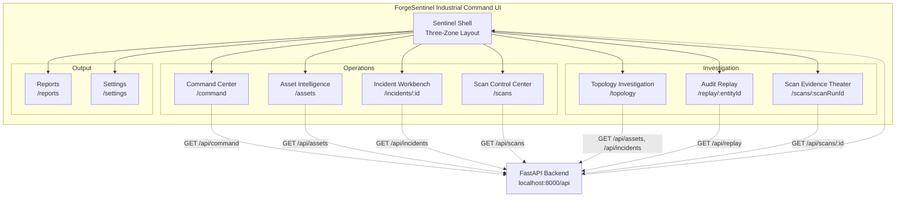
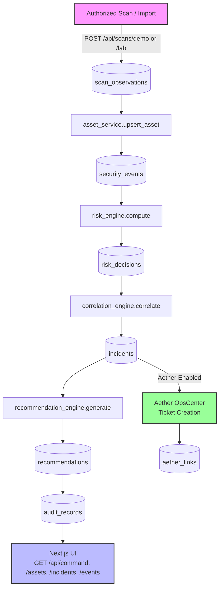

# ForgeSentinel

**ForgeSentinel: Manufacturing SOC & Asset Risk Intelligence Platform**

Built a manufacturing-focused SOC and asset risk intelligence platform that turns network scan observations into explainable security decisions. The system ingests demo or authorized lab scan data, normalizes discovered assets, computes deterministic risk scores, correlates incidents, generates analyst recommendations, stores audit replay records, and optionally creates Aether OpsCenter tickets for operational response.

This is not a dashboard with mock data — it is a functional operational security intelligence system.

## UI Architecture

ForgeSentinel uses a three-zone industrial command shell. Every module is API-backed via the FastAPI backend.



## Data Pipeline Architecture

The backend runs a deterministic pipeline from raw scan observations to auditable risk decisions and incident correlations.



## Core Workflows

- **Command Center**: `/command` is the real-time SOC workspace with command summary, KPI grid, prioritized risk queue, active incident panel, live event stream, exposure charts, topology preview, and scan status.
- **Asset Intelligence**: `/assets` provides object-centric asset workflows with API-backed inventory, risk decisions, triggered rules, ports, evidence, and audit trails. Includes exposure finding badges per asset.
- **Incident Workbench**: `/incidents/[incidentId]` shows correlated security incidents with evidence timelines, decision traces, analyst notes, ranked recommendations, and Aether ticket creation.
- **Scan Control Center**: `/scans` is the scan operations floor — launch scans, monitor live progress, review scan history, inspect exposure findings, and select scan profiles. Toast notifications for scan lifecycle events.
- **Scan Evidence Theater**: `/scans/[scanRunId]` provides full audit replay for any scan — lifecycle panel, host evidence table, port ledger, exposure findings list, and scan metadata.
- **Topology**: `/topology` visualizes assets by segment using React Flow with risk rings, incident correlations, and clickable asset details.
- **Audit Replay**: `/replay/[entityId]` provides asset and incident audit replay with expandable raw JSON for explainability.
- **Reports and Settings**: `/reports` and `/settings` support evidence packages, response governance, safe demo scanning, and opt-in lab scanning controls.

## Scanning Engine

### Scan Profiles

ForgeSentinel supports configurable scan profiles for different operational contexts:

| Profile | Ports | Max Hosts | Delay | Use Case |
|---------|-------|-----------|-------|----------|
| `safe_discovery` | 22, 80, 443, 445, 3389, 9100 | 256 | 100ms | Low-impact discovery scan |
| `ot_visibility` | OT protocols (Modbus, Ethernet/IP, S7, BACnet) | 256 | 500ms | OT-aware exposure scan |
| `windows_domain` | 53, 88, 135, 139, 389, 445, 3389 | 512 | 50ms | Windows/domain exposure scan |
| `deep_private` | 34 ports (full IT/OT coverage) | 1024 | 0ms | Broader authorized private network scan |
| `conservative_ot` | 80, 443, 502, 44818, 102 | 64 | 1000ms | Ultra-conservative OT scan — one host at a time |

### Host Discovery

Production scanners do not blindly scan every host. ForgeSentinel performs a discovery phase:

- **ICMP ping sweep** — for responsive hosts
- **ARP probe** — for same-subnet MAC discovery
- **TCP ping** — against common ports (80, 443, 445, 3389, 22)
- **"Treat all hosts as alive"** — for firewalled environments

Only responsive hosts proceed to full port scanning.

### Real TCP Connect Scanning

- **Port scanning**: Real `socket.connect_ex()` against configurable port lists
- **Service fingerprinting**: Safe banner grabbing for HTTP/HTTPS (Server header, TLS cert), SSH (banner), FTP (welcome), SMTP (greeting)
- **Hostname resolution**: Reverse DNS + NetBIOS fallback
- **MAC discovery**: ARP table parsing with active ARP probes
- **Vendor attribution**: MAC OUI lookup with offline cache + 200+ vendor static fallback
- **Asset type classification**: Heuristic classification from ports + hostname (PLC, HMI, Server, Workstation, Printer, etc.)
- **Rate limiting**: Per-profile concurrent host/port limits, delay between hosts, connection timeouts
- **Background execution**: Scans run asynchronously with lifecycle control (queued → running → completed/failed/cancelled)

### Scan Governance

- **Authorization scopes**: Approved CIDR ranges with expiration, site, environment, and allowed profiles
- **Private network only**: Public internet CIDRs are rejected
- **Host count limits**: Configurable `SCAN_MAX_HOSTS` with profile-specific overrides
- **Cancellation**: Active scans can be cancelled via API
- **Full audit trail**: Every scan creates audit records with evidence

## Data Sources

- **Lab mode** (Real Scanning): `POST /api/scans/lab` performs actual TCP connect scanning against authorized private networks with discovery, fingerprinting, and full pipeline execution. Requires `REAL_SCAN_ENABLED=true` and a matching authorization scope.
- **Demo mode**: `POST /api/scans/demo` seeds the database with realistic manufacturing fixture data for demonstration and testing. Safe by default. Does not touch the network.
- **API endpoints**: All UI data is fetched live from `GET /api/command`, `GET /api/assets`, `GET /api/incidents`, `GET /api/events`, etc.

## Aether Integration

ForgeSentinel detects and explains security risk. Aether OpsCenter routes and governs the operational response.

Environment variables:
- `AETHER_ENABLED=false` (default) — creates a local pending AetherLink with `sync_status="disabled"`
- `AETHER_API_BASE_URL` — Aether OpsCenter API endpoint
- `AETHER_API_TOKEN` — Authentication token

When `AETHER_ENABLED=true`, ForgeSentinel sends incident payloads (title, priority, affected assets, risk score, evidence, recommendations) to Aether and stores the ticket ID and URL locally.

## Risk Engine

Deterministic, explainable risk scoring computed from real scan observations:

- **Exposure score**: Open ports weighted by service risk (Telnet, RDP, SMB, Modbus, VNC, MSSQL, RPC, JetDirect, etc.)
- **Authorization score**: Unauthorized assets = +35, unknown = +18
- **Asset criticality**: PLC = +28, production workstation = +22, HMI = +24, server = +20
- **Event severity**: Recent critical/high security events
- **Recency score**: Newly discovered assets receive elevated attention
- **Correlation score**: Existing incident correlation increases risk
- **Uncertainty penalty**: Unknown or unverified owner/operator

Total risk score clamped 0-100. Levels: critical (≥80), high (≥60), medium (≥40), low.

Every risk decision includes a full feature snapshot, triggered rules list, and human-readable explanation — stored for audit replay and analyst review.

## Exposure Findings

Deterministic exposure detection without claiming CVE scanning:

| Finding | Rule | Severity |
|---------|------|----------|
| Remote admin exposed | RDP, VNC, Telnet, SSH open | critical/high |
| File sharing exposed | SMB/NetBIOS open | critical/high |
| OT control exposed | Modbus, Ethernet/IP, S7 open | critical |
| Database exposed | MSSQL, MySQL, PostgreSQL open | critical/high |
| Printer/IoT exposed | JetDirect, IPP open | medium |
| Web admin exposed | HTTP/HTTPS on embedded devices | high |
| Unknown asset in production | Unverified asset in production segment | high |
| Telnet exposed | Port 23 — cleartext auth | critical |
| Large attack surface | ≥8 open services | medium |

## Asset Identity Reconciliation

Prevents duplicate assets across scans:

- **MAC exact match** — 95% confidence
- **Hostname exact match within site** — 85% confidence
- **IP exact match within scan window** — 60% confidence
- **Vendor + hostname similarity** — 50% confidence

Every field tracks its source: `mac_source`, `hostname_source`, `vendor_source`, `ip_source`.

## Tech Stack

| Layer | Technology |
| --- | --- |
| Frontend | Next.js 14 App Router, React 18, TypeScript |
| Backend | FastAPI, SQLAlchemy, SQLite |
| Network Scanning | Python socket TCP connect, ICMP ping, ARP probe, DNS/NetBIOS resolution, MAC OUI vendor lookup, service banner grabbing |
| Scan Orchestration | Background threads with lifecycle control (queued/running/paused/cancelled/completed/failed) |
| Risk Engine | Deterministic multi-factor scoring with explainable decisions |
| Correlation | Rule-based incident correlation with confidence scoring |
| Exposure Detection | Deterministic exposure findings from scan evidence |
| Styling | Tailwind-compatible design tokens plus production CSS |
| State | Zustand + TanStack React Query |
| Tables | TanStack Table |
| Charts | Recharts |
| Topology | React Flow |
| Motion | Framer Motion |
| Icons | Lucide React |
| API Client | Axios in `lib/api.ts` |
| Notifications | Sonner toast notifications |
| Code Quality | ruff (Python lint), pytest (API tests) |
| Build | Next.js build + Vite build with vendor chunk splitting |

## Environment Configuration

```bash
# Required for real scanning
REAL_SCAN_ENABLED=true
SCAN_ALLOWED_CIDRS=192.168.0.0/16,10.0.0.0/8,172.16.0.0/12
SCAN_MAX_HOSTS=1024
SCAN_HOST_WORKERS=50
SCAN_PORT_WORKERS=100
SCAN_CONNECT_TIMEOUT=1.0
SCAN_RATE_LIMIT_PER_SECOND=100

# Aether integration
AETHER_ENABLED=false
AETHER_API_BASE_URL=https://aether.example.com/api
AETHER_API_TOKEN=your-token

# Database
DATABASE_URL=sqlite:///./forgesentinel.db
```

## Development

```bash
# Install frontend dependencies
npm install

# Install backend dependencies
python3 -m venv api-venv
source api-venv/bin/activate
pip install -r apps/api/requirements.txt

# Run both frontend and backend
npm run dev
```

- Frontend: http://localhost:3005
- Backend API: http://localhost:8000/api

### Available Scripts

| Script | Description |
|--------|-------------|
| `npm run dev` | Start both frontend and backend concurrently |
| `npm run dev:web` | Start Next.js dev server on port 3005 |
| `npm run dev:api` | Start FastAPI backend with auto-reload on port 8000 |
| `npm run build` | Build Next.js for production |
| `npm run vite:build` | Build Vite bundle with vendor chunk splitting |
| `npm run test:api` | Run pytest API test suite |
| `npm run lint:api` | Run ruff lint on all Python code |
| `npm run typecheck:api` | Run mypy type checking on Python code |

## Production Build

```bash
# Build Next.js frontend
npm run build

# Build Vite bundle (vendor chunks auto-split)
npm run vite:build

# Start backend
source api-venv/bin/activate
PYTHONPATH=. uvicorn apps.api.main:app --port 8000
```

The Vite build splits vendor libraries into separate chunks (react, radix, motion, charts, data) for optimal caching and load performance.

## Tests

```bash
source api-venv/bin/activate
pytest tests/test_api.py -v
```

Tests cover:
- Demo scan writes assets/events/incidents to DB
- Risk engine produces critical score for unauthorized SMB/RDP asset
- Lab scan blocked when `REAL_SCAN_ENABLED=false`
- Public CIDR rejected for lab scan
- Command endpoint returns database-backed metrics
- Aether ticket creation records pending link when integration is disabled
- Aether ticket creation is idempotent (duplicate prevention)

### Lint

```bash
npm run lint:api
```

Backend lint is enforced with ruff. All code passes with zero errors.

## Project Structure

```
app/                  Next.js App Router pages
components/           React components
lib/
  api.ts              Real API client (no hardcoded data)
  types.ts            TypeScript types matching API schema
  hooks/              TanStack React Query hooks
  fixtures/           Demo/seed data only
  query-client.tsx    React Query provider
  store.ts            Zustand state
apps/api/             FastAPI backend
  main.py             App entrypoint with CORS and routers
  config.py           Pydantic settings with scan engine config
  models/             SQLAlchemy ORM models
    scan.py           ScanRun, ScanHostResult, ScanPortResult, ScanAuthorizationScope
    asset.py          Asset
    event.py          SecurityEvent
    risk.py           RiskDecision
    incident.py       Incident
    audit.py          AuditRecord, AetherLink
  schemas/            Pydantic request/response schemas
  routes/             FastAPI routers
  services/           Business logic
    scan_service.py   Demo + lab scan orchestration
    scan_worker.py    Background scan execution
    network_scanner.py Production-grade TCP scanning engine
    scan_profiles.py  Configurable scan profiles
    oui_provider.py   MAC OUI vendor lookup with caching
    asset_identity.py Asset identity reconciliation
    exposure_findings.py Deterministic exposure detection
    risk_engine.py    Deterministic risk scoring
    correlation_engine.py Incident correlation
    asset_service.py  Asset CRUD
    event_service.py  Event CRUD
    replay_service.py Audit replay
 tests/                pytest test suite
```
