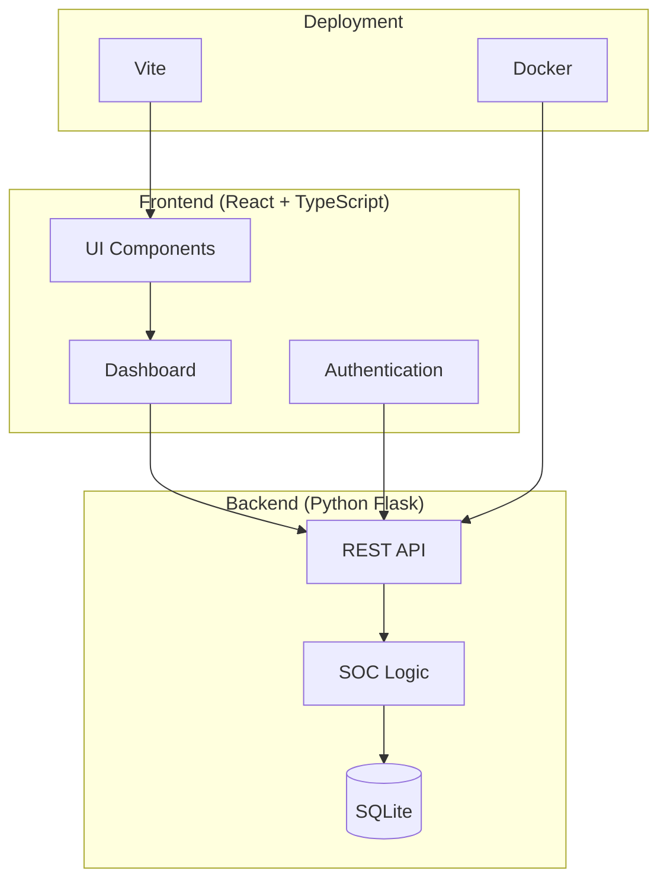

# Integrate Security Operations Center

A comprehensive Security Operations Center (SOC) Dashboard for monitoring, analyzing, and responding to security events in real-time.

## Architecture Overview



## Features

- 🔐 **Authentication** - Secure Firebase-based login
- 📊 **Real-time Analytics** - Live security metrics and charts
- 🚨 **Alert Management** - Track and respond to security alerts
- 🌐 **Network Monitoring** - Scan and monitor network devices
- 📈 **Threat Intelligence** - Advanced threat detection and analysis
- 🎨 **Modern UI** - Built with Shadcn/ui and Tailwind CSS

## Tech Stack

| Component | Technology |
|-----------|------------|
| Frontend | React 18, TypeScript, Vite |
| UI | Shadcn/ui, Tailwind CSS |
| Charts | Recharts |
| Backend | Python Flask |
| Database | SQLite |
| Auth | Firebase |
| Deploy | Docker |

## Getting Started

### Prerequisites

- Node.js 18+
- Python 3.10+
- Docker (optional)

### Installation

```bash
# Install frontend dependencies
npm install

# Install backend dependencies
pip install -r requirements.txt
```

### Development

```bash
# Start the development server
npm run dev
```

### Docker Deployment

```bash
# Build and run with Docker Compose
docker-compose up --build
```

## Documentation

- [Architecture Details](./ARCHITECTURE.md)
- [Docker Deployment Guide](./DOCKER_DEPLOYMENT.md)

## Original Design

The original project design is available at [Figma](https://www.figma.com/design/KOpjY9jvT4V6cByOKVqi4w/Integrate-Security-Operations-Center).