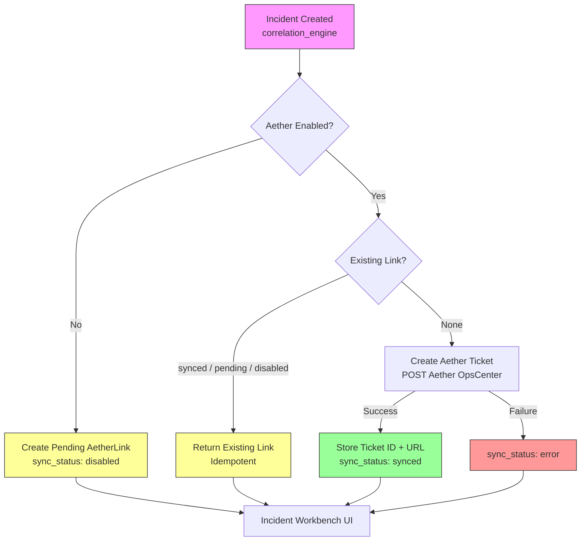

# ForgeSentinel UI Overhaul and Aether Hardening

Date: 2026-04-27

## Summary

This pass redesigned and tightened the active Next.js command UI and kept the legacy Vite dashboard usable. The main goals were to improve the topology experience, make Aether incident ticket creation reliable, and remove fake or placeholder controls that appeared clickable but had no real behavior.

## Aether Integration



- Incident responses now include the latest Aether ticket state:
  - `aether_ticket_id`
  - `aether_ticket_url`
  - `aether_sync_status`
- Aether ticket creation is idempotent. If an incident already has a usable Aether link in `synced`, `disabled`, or `pending` state, the backend returns the existing link instead of creating duplicates.
- The incident workbench now displays clear Aether states:
  - synced
  - pending
  - disabled
  - error
- If Aether returns a ticket URL, the UI exposes an external link to open it.
- Tests cover disabled mode and duplicate prevention.

## Next.js UI Changes

- A second image-led redesign pass used generated UI references for the command center and topology surfaces, then translated them into the app.
- `/command` now opens with a cinematic editorial command hero:
  - industrial image treatment
  - restrained amber accent
  - real scan and topology CTAs
  - GSAP entrance animation and scroll-linked motion
  - inline media embedded in display typography
- `/command` now uses a gapless 12-column bento intelligence layout for risk queue, incident focus, live events, exposed services, and scan status.
- `/command` includes a kinetic marquee and sticky investigation stack to avoid the previous generic dashboard-card rhythm.
- `/topology` was rebuilt around a more meaningful React Flow graph:
  - segment anchor nodes
  - asset nodes with hostname, IP, authorization, ports, type icon, and risk ring
  - risk filters
  - segment filter
  - incident correlation edges
  - empty state when filters hide all nodes
- `/topology` now includes a persistent investigation rail with visible asset counts, critical/unauthorized totals, Aether handoff guidance, and active incident paths, so small datasets do not leave a large empty graph void.
- `/incidents/[incidentId]` now wires recommendation acceptance to the existing API.
- Report-generation controls that are not backed by an implementation are disabled and labeled honestly instead of acting as fake buttons.
- The global search bar now routes to `/assets?query=...`.
- `/assets` applies global search query filtering across hostname, IP, MAC, asset UID, authorization, segment, type, and open ports.
- Notification and drawer actions without backend support are disabled with explanatory titles.
- Shared CSS now includes clearer disabled states, Aether status styling, topology node styling, segment-node styling, and stable topology node dimensions.

## Legacy Vite UI Changes

- `addDevice()` now calls `/api/security/add-device` instead of logging a placeholder.
- Removed unused placeholder trust/delete API helpers.
- The legacy canvas network map now supports drag panning.
- High/critical risk devices render as warning nodes in the map.
- The advanced event filter, Add User control, and unsupported theme/report-style controls are no longer fake active buttons.
- Settings controls that can be session-backed now update local session state and show real feedback.

## Verification

The following checks passed:

```bash
npm run build
npm run vite:build
npm run test:api
```

API test result:

```text
7 passed
```

## Notes

- The Next.js app remains the primary production surface.
- The Vite dashboard remains supported enough to avoid dead controls and placeholder behavior.
- Report generation, notifications, and asset-level feedback workflows are intentionally marked unavailable until real backend workflows are added.
- `.next/` was already untracked before this pass and remains an untracked generated build directory.
